# Helix

> **AI-powered Repository Intelligence Platform for Developer
> Onboarding, Architecture Discovery, and Codebase Understanding**

**Live Demo:** https://helixcode.vercel.app

**Repository:** https://github.com/NoelNinanSheri1307/Helix


</p>

<p align="center">


------------------------------------------------------------------------

# Table of Contents

-   Overview
-   Features
-   System Architecture
-   Processing Pipeline
-   Technology Stack
-   Screenshots
-   Installation
-   Environment Variables
-   Usage
-   Project Structure
-   Deployment
-   Roadmap
-   Known Limitations
-   Contributing
-   License
-   Acknowledgements
-   Author

------------------------------------------------------------------------

# Overview

Modern software repositories often contain thousands of files spread
across multiple architectural layers. Understanding an unfamiliar
codebase requires significant manual effort and institutional knowledge.

Helix is an AI-powered Repository Intelligence Platform that automates
repository understanding by combining static analysis, AST parsing,
semantic embeddings, knowledge graphs, execution-flow extraction, and
LLM-powered reasoning into a unified developer experience.

Unlike traditional AI chat interfaces that rely only on language models,
Helix first builds a structural understanding of a repository before
answering questions. This grounding allows responses to be based on
verified repository intelligence rather than generic reasoning.

Helix is designed for:

-   Developer onboarding
-   Architecture discovery
-   Codebase exploration
-   Repository documentation
-   Engineering productivity
-   Technical interviews
-   Software maintenance

------------------------------------------------------------------------

# Features

## Repository Intelligence

-   Clone public GitHub repositories
-   Pull latest repository updates
-   Automatic synchronization
-   Repository lifecycle management
-   Repository metadata tracking

## Architecture Intelligence

-   AST-based repository parsing
-   Component discovery
-   Knowledge Graph generation
-   Code Atlas generation
-   Dependency mapping
-   Execution Flow extraction
-   Repository summaries

## AI Assistant

-   Repository-aware AI Chat
-   Explain Mode
-   Deep Analysis Mode
-   Semantic retrieval
-   Context assembly
-   Evidence-grounded responses
-   Google Gemini integration

## Developer Onboarding

-   Automatic onboarding documents
-   Architecture summaries
-   Component explanations
-   Service identification
-   Framework detection
-   Repository overview

## Production

-   Google OAuth
-   NextAuth authentication
-   PostgreSQL (Neon)
-   FastAPI backend
-   Next.js frontend
-   Vercel deployment
-   Render deployment

------------------------------------------------------------------------

# System Architecture

``` text
                     User
                       │
                       ▼
               Next.js Frontend
                       │
                       ▼
               FastAPI Backend
                       │
       ┌───────────────┴───────────────┐
       ▼                               ▼
 Repository Management          PostgreSQL (Neon)
       │
       ▼
 Repository Clone / Pull
       │
       ▼
 AST Parsing
       │
       ▼
 Knowledge Graph
       │
       ▼
 Execution Flow Engine
       │
       ▼
 Semantic Embeddings
       │
       ▼
 Context Assembly
       │
       ▼
 Gemini 2.5 Flash
       │
       ▼
 Repository Chat
```

------------------------------------------------------------------------

# Processing Pipeline

1.  User signs in with Google.
2.  Repository is cloned.
3.  Repository metadata is stored.
4.  AST parsing extracts entities.
5.  Knowledge Graph is generated.
6.  Code Atlas is generated.
7.  Execution flows are extracted.
8.  Semantic embeddings are created.
9.  Repository becomes chat-ready.
10. Repository Chat answers questions using grounded context.

------------------------------------------------------------------------

# Technology Stack

  Layer             Technology
  ----------------- ----------------------------
  Frontend          Next.js, React, TypeScript
  Backend           FastAPI
  Database          PostgreSQL (Neon)
  Authentication    Google OAuth, NextAuth
  AI                Gemini 2.5 Flash
  Embeddings        Sentence Transformers
  Static Analysis   Tree-sitter
  Hosting           Vercel, Render
  Version Control   GitHub

------------------------------------------------------------------------

# Screenshots

<h2 align="center">Landing Page</h2>

<p align="center">
The landing page introduces Helix and provides Google OAuth authentication for secure access.
</p>

<p align="center">
  
</p>

---

<h2 align="center">Sign In</h2>

<p align="center">
Secure authentication powered by Google OAuth.
</p>

<p align="center">
  
</p>

---

<h2 align="center">Dashboard</h2>

<p align="center">
The central workspace for managing repositories, monitoring analysis status, and accessing Helix's intelligence modules.
</p>

<p align="center">
  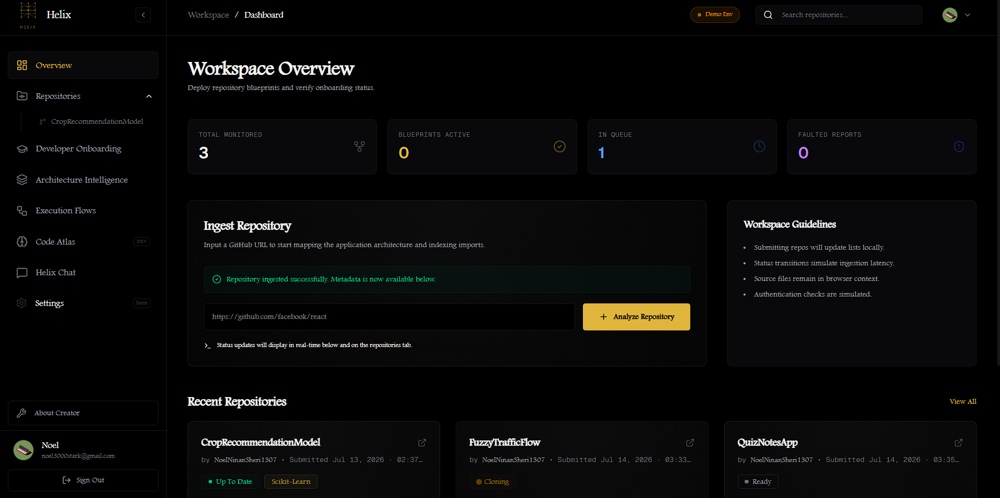
</p>

---

<h2 align="center">Repository Overview</h2>

<p align="center">
Displays repository metadata, analysis progress, and available intelligence modules.
</p>

<p align="center">
  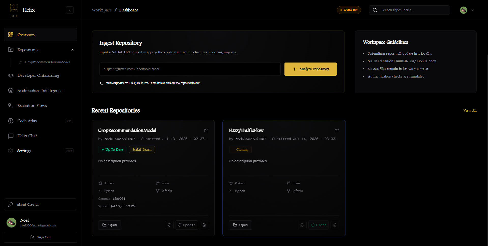
</p>

---

<h2 align="center">Repository Chat</h2>

<p align="center">
Repository-aware AI assistant capable of answering grounded questions using repository intelligence.
</p>

<p align="center">
  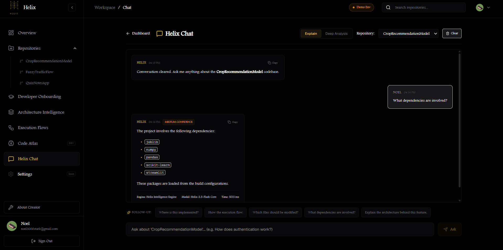
</p>

---

<h2 align="center">Developer Onboarding</h2>

<p align="center">
Automatically generates onboarding documentation to help new developers understand unfamiliar codebases.
</p>

<p align="center">
  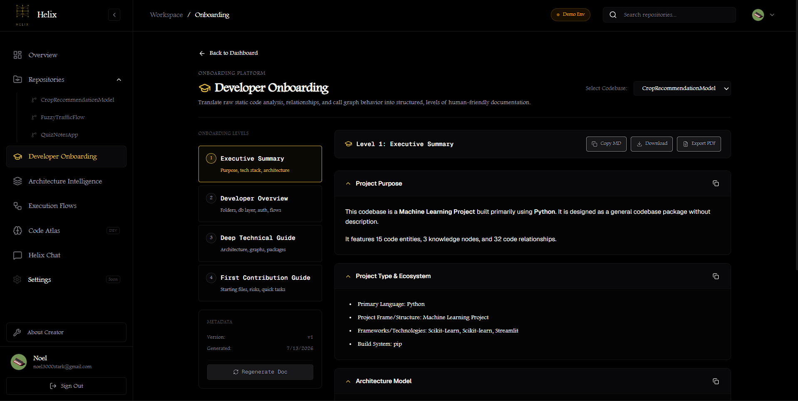
</p>

---

<h2 align="center">Architecture Intelligence</h2>

<p align="center">
Visualizes architectural components, relationships, and high-level repository organization.
</p>

<p align="center">
  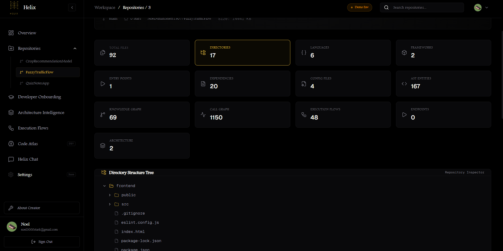
</p>

---

<h2 align="center">System Architecture</h2>

<p align="center">
High-level architecture of the Helix platform.
</p>

<p align="center">
  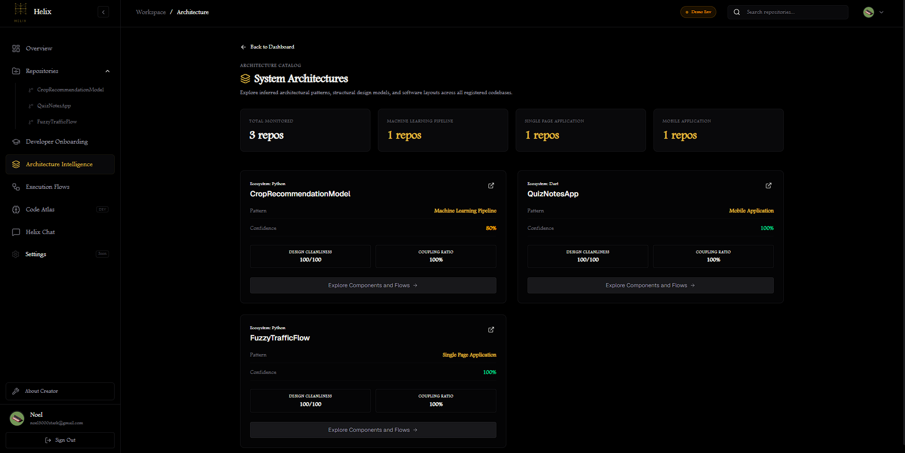
</p>

---

<h2 align="center">Configuration</h2>

<p align="center">
Environment configuration, deployment settings, and runtime management.
</p>

<p align="center">
  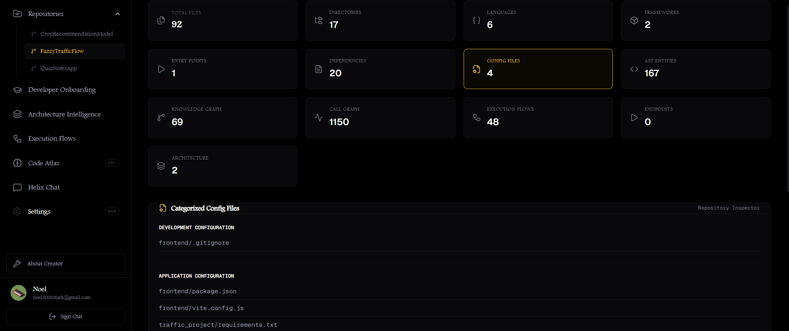
</p>

---

<h2 align="center">Execution Flows</h2>

<p align="center">
Extracted execution paths showing how requests and components interact throughout the repository.
</p>

<p align="center">
  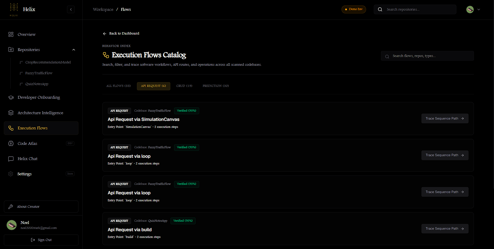
</p>

---

<h2 align="center">Code Atlas</h2>

<p align="center">
Automatically generated structural map of the repository.
</p>

<p align="center">
  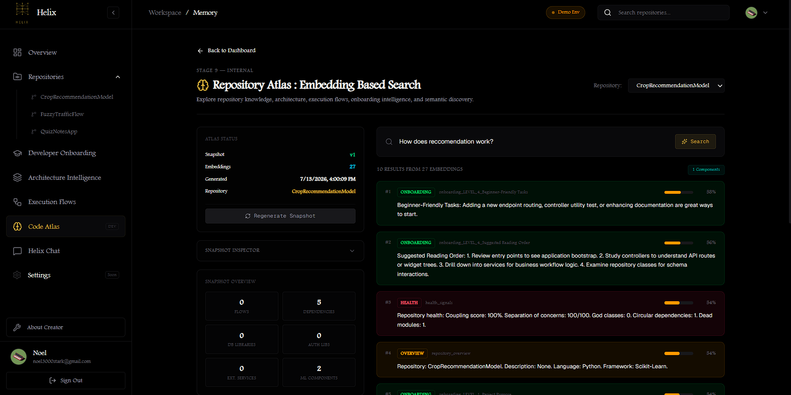
</p>

---

<h2 align="center">Knowledge Graph</h2>

<p align="center">
Graph representation of repository entities and their relationships.
</p>

<p align="center">
  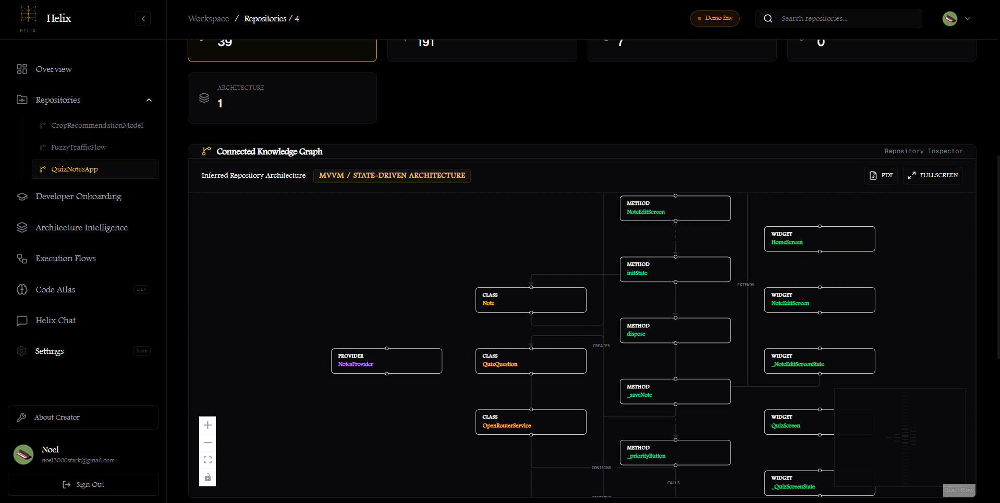
</p>

---

# Architecture Diagrams

<h2 align="center">Overall System Architecture</h2>

<p align="center">
The following diagrams illustrate Helix's internal architecture, repository analysis pipeline, and processing workflow.
</p>

<p align="center">
  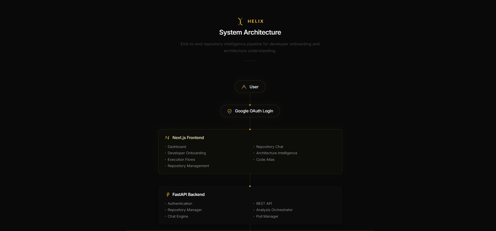
</p>

---

<h2 align="center">Repository Intelligence Pipeline</h2>

<p align="center">
  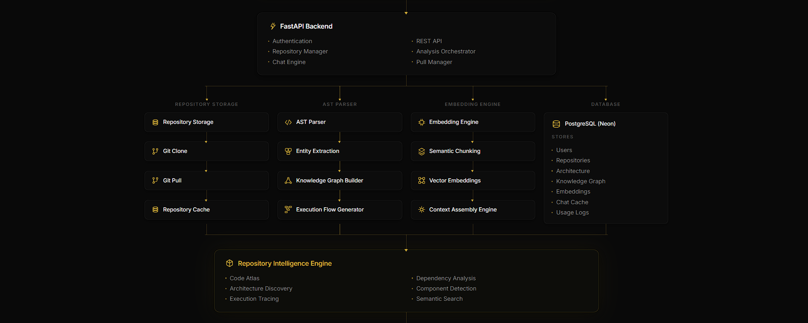
</p>

---

<h2 align="center">Repository Processing Workflow</h2>

<p align="center">
  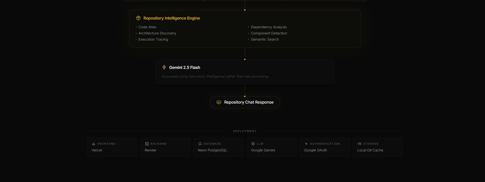
</p>
------------------------------------------------------------------------

# Installation

## Clone

``` bash
git clone https://github.com/NoelNinanSheri1307/Helix.git
cd Helix
```

## Backend

``` bash
cd backend
pip install -r requirements.txt
uvicorn main:app --reload
```

## Frontend

``` bash
cd frontend
npm install
npm run dev
```

------------------------------------------------------------------------

# Environment Variables

## Backend

``` env
DATABASE_URL=
GEMINI_API_KEY=
FRONTEND_URL=
REPOSITORY_STORAGE_PATH=
GITHUB_TOKEN=
```

## Frontend

``` env
NEXT_PUBLIC_API_URL=
GOOGLE_CLIENT_ID=
GOOGLE_CLIENT_SECRET=
NEXTAUTH_SECRET=
NEXTAUTH_URL=
```

------------------------------------------------------------------------

# Usage

1.  Sign in using Google.
2.  Clone a public GitHub repository.
3.  Generate the Code Atlas.
4.  Wait for embeddings and repository intelligence generation.
5.  Open Repository Chat.
6.  Ask repository-specific questions.
7.  Pull updates whenever the repository changes.

------------------------------------------------------------------------

# Project Structure

``` text
Helix/
├── frontend/
├── backend/
├── repository_storage/
├── docs/
├── screenshots/
└── README.md
```

------------------------------------------------------------------------

# Deployment

  Component   Platform
  ----------- -----------------
  Frontend    Vercel
  Backend     Render
  Database    Neon PostgreSQL

------------------------------------------------------------------------

# Roadmap

Future work is tracked publicly through:

-   GitHub Issues
-   Helix v2.0 Milestone
-   Helix Roadmap Project

Planned features include:

-   Integrated Code Viewer
-   Multi-file Navigation
-   Cross-Referenced Intelligence
-   Pull Request Intelligence
-   Repository Health Dashboard
-   Repository Comparison
-   Duplicate Code Detection
-   Incremental Repository Re-analysis
-   Exportable Reports

------------------------------------------------------------------------

# Known Limitations

> **Demo Environment Notice**

Helix is currently hosted on free-tier cloud infrastructure for
demonstration purposes. Large repositories or deep analyses may
occasionally take longer to process or be interrupted due to temporary
resource limits.

These limitations are specific to the demo deployment environment and
not to Helix itself.

For an unrestricted demonstration or production deployment, please
contact Noel Ninan Sheri.

------------------------------------------------------------------------

# Contributing

Contributions, feature requests, and issue reports are welcome.

Please open an Issue before submitting large changes.

------------------------------------------------------------------------

# License

Copyright © 2026 Noel Ninan Sheri.

This repository is published for portfolio, educational, and evaluation purposes.

No permission is granted to copy, modify, redistribute, sublicense, or commercialize this software or any substantial portion of it without prior written permission from the author.

All rights reserved.
------------------------------------------------------------------------

# Acknowledgements

-   Google Gemini
-   FastAPI
-   Next.js
-   Tree-sitter
-   Sentence Transformers
-   PostgreSQL
-   Neon
-   Render
-   Vercel

------------------------------------------------------------------------

# Author

**Noel Ninan Sheri**

LinkedIn: https://www.linkedin.com/in/noel-ninan-sheri/

Email: noelninansheri@gmail.com

------------------------------------------------------------------------

If you found Helix useful, consider starring the repository.
